# Cheers To Beers  

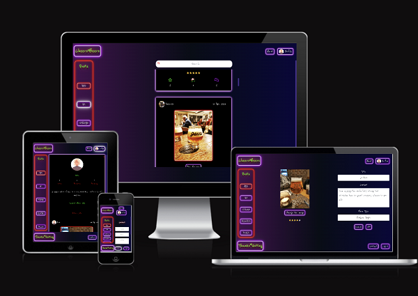  

Cheers To Beers is a social media platform where users can show their love of different beers and share a drink with one another even if they aren't in the same room. It offers the chance to find friends, interact and review their own drinks.  
The deployed site can be found here - [Cheers-To-Beers](https://cheers-to-beers-4e5512c864fe.herokuapp.com/)  

This website uses the Cheers To Beers API.  
The repository can be found here- [Cheers-API-GitHub-Repository](https://github.com/DavidDock/cheers-api)  
The deployed API found here- [Cheers-API](https://cheers-to-beers-api-5a858b4697bd.herokuapp.com/) 

## CONTENTS

- [Cheers To Beers](#cheers-to-beers)
  - [CONTENTS](#contents)
  - [User Experience](#user-experience)
    - [Who is the Website for](#who-is-the-website-for)
    - [Design](#design)
    - [Colour Scheme](#colour-scheme)
    - [Typography](#typography)
    - [Wireframes](#wireframes)
  - [Agile Methodology](#agile-methodology)
  - [Technologies Used](#technologies-used)
    - [Languages Used](#languages-used)
    - [Frameworks Libaries and Programs Used](#frameworks-libaries-and-programs-used)
  - [Features](#features)
    - [Current Features](#current-features)
    - [Accessibility](#accessibility)
    - [Future Implementations](#future-implementations)
  - [Deployment](#deployment)
    - [Heroku](#heroku)
    - [Fork Repository](#fork-repository)
    - [Clone Repository](#clone-repository)
  - [Testing](#testing)
  - [Credits](#credits)
    - [Learning](#learning)
  - [Media](#media)

## User Experience

### Who is the Website for  
For people with an interest in beers and wish to interact with other like minded people through a social media website. It allows people to review their drinks and interact with other members by giving them a cheers, commenting their post or following them. It allows people to share a drink with each other even if they are not physically together.

### Design  
The idea of this website is to take the user into a bar setting with a dark background and neon colors to emulate bar signs.

### Colour Scheme
The color scheme fits in with the overall design goals. With a dark overall feel with neon colors to match the atmosphere of a bar.  
To meet WCAG 2.0 criteria, the color scheme was then passed to [eightshapes.com](https://eightshapes.com/) to generate an accessibility table, only accessible text colors were then used to ensure easy reading. Prominently white text was used as this worked well with the design theme.

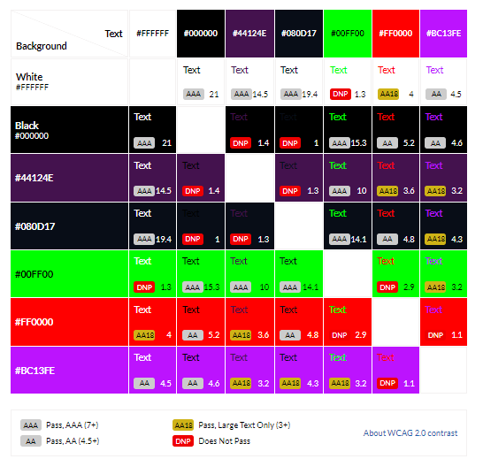

### Typography
The choice of Typography again follows the overall style. Reenie-Beanie from [Google Fonts](https://fonts.google.com/specimen/Reenie+Beanie) was used throughout to add some playful style to the website.

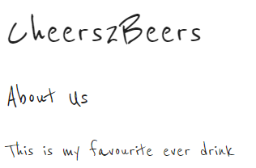

### Wireframes
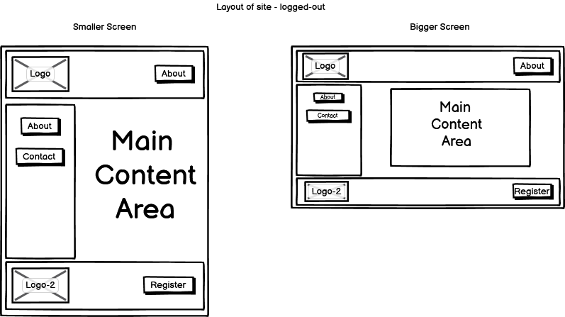
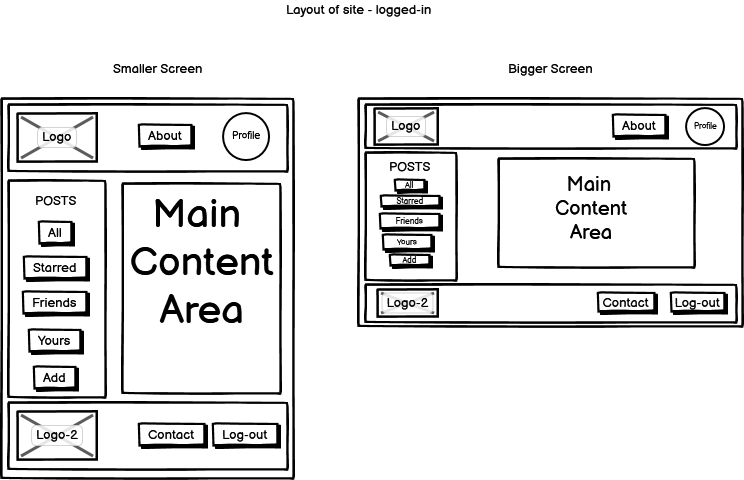
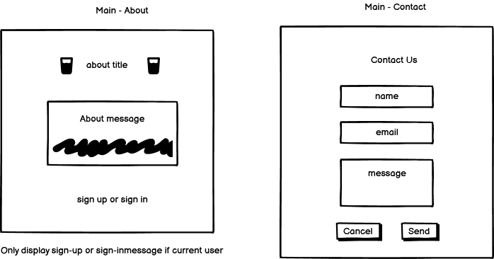
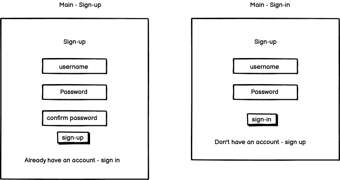

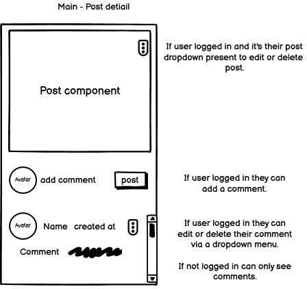
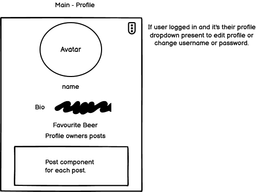
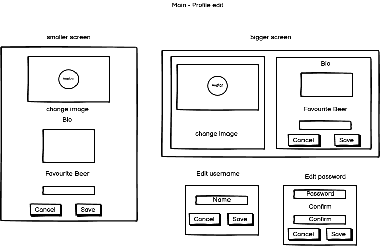

## Agile Methodology 

Agile methodology was used throughout the development for this project and I found it extremley helpful to keep track of my project.

The project was broken down into Epics and User Stories and the MoSCoW method was used to determine relevant features needed for the scope of this project.

Issues were created in GitHub for each Epic and User Story with Tasks to complete and MoSCoW labels on each one. A Kanban board was also created to keep track of these Issues. A Milestone for the MVP was also created and linked to relevant Issues.

The project's issues can be found [Here](https://github.com/DavidDock/cheers-to-beers/issues)

The project's Kanban board can be found [Here](https://github.com/users/DavidDock/projects/3)

The User Story table can be found below:

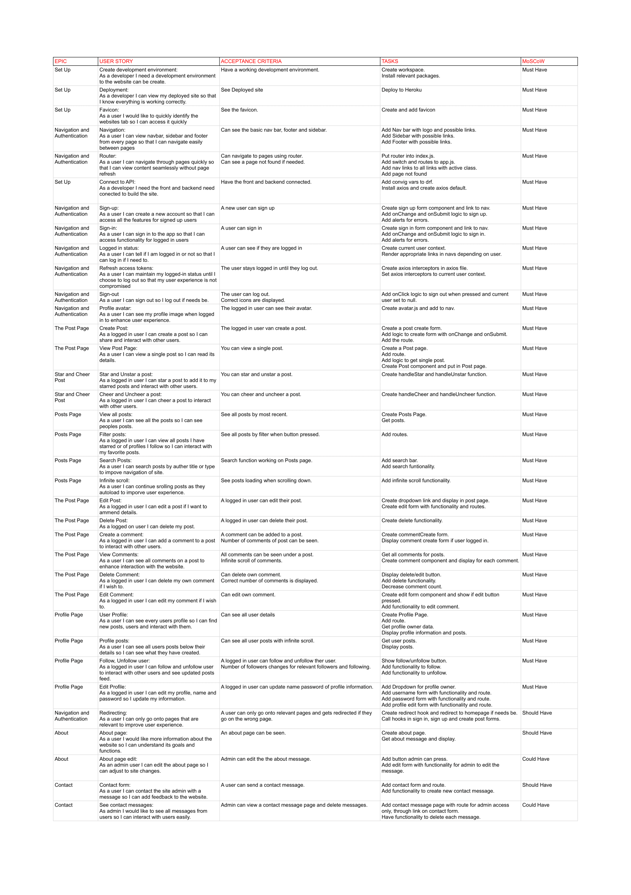

## Technologies Used  

### Languages Used  

- HTML
- CSS
- JavaScript
- JSX - React converts into Javascript 

### Frameworks Libaries and Programs Used  

- Git - Used for version control
- GitHub - Used to store the repository and GitHub projects for the Kanban board
- React - Frontend javascript libary used to build the site
- React Bootstrapp - CSS framework used to help build a responsive site
- Heroku - Used to deploy the website
- [Simple-Star-Rating](https://www.npmjs.com/package/react-simple-star-rating)- A react component to add a star rating
- [React-Toastify](https://www.npmjs.com/package/react-toastify) - A package allowing simple notifications to the user
- [Google Fonts](https://fonts.google.com/) - Used for the font
- [balsamiq](https://balsamiq.com/) - Used to create wireframes

## Features

### Current Features

#### Navigation Bars and Footer  

Having three navigation bars allows users to have easy access to all features. These navigation bars are pivotal to the overall design theme of the website echoing bar signs and menus, giving the user the feel that they are in a virtual bar.

#### Top Nav Bar
User Logged Out  

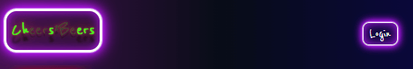

User Logged In  

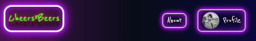  

The Top Nav bar has the LOGO for Cheers To Beers which links back to home displaying all posts. If the user is not a member it allows the user to go to the log in page. If the user is a member their profile image is displayed with a link to thier profile and also a link to the about page.

#### Footer
User Logged Out  

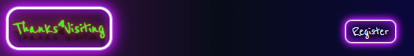

User Logged In  

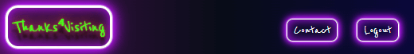  

The Footer has a Goodbye LOGO and If the user is a member a logout button and a link to the contact page. If the user is not a member it provides a link to the registration page.

#### Side Nav bar
User Logged Out and In 

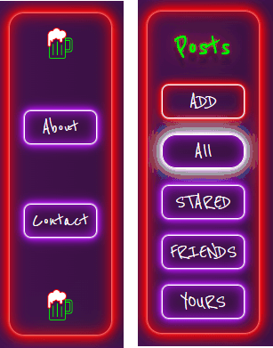  

The Side navigation bar allows the logged in user easy access to filter the posts by them all, their starred posts, their friends posts and their own posts. If the are not logged in yet then it provides links to the about and contact pages.

### Register and Log In

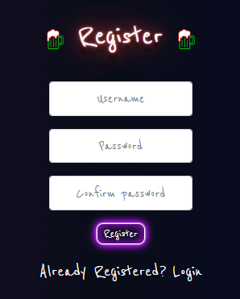
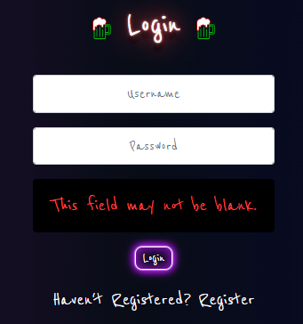  

The User can Register and Log In, they are prompted if an error is made during form submission.

### Create Post

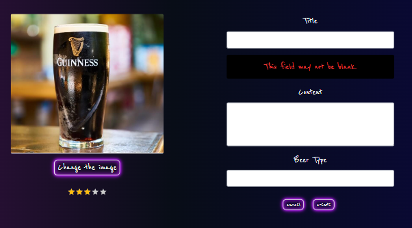  

The User can create a post with a image and title required and a score, content and beer type optional. 
The [Simple-Star-Rating](https://www.npmjs.com/package/react-simple-star-rating) was installed and used to input/update the score to improve user experience.  
The user is given an error message if the form data is invalid or left blank. Once they create their post it takes them to the created post page.  

### Delete Post

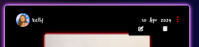  

The Logged in user can see the "Three dot" dropdown menu on their own posts and when clicking the bin button it deletes their post.

### Edit Post

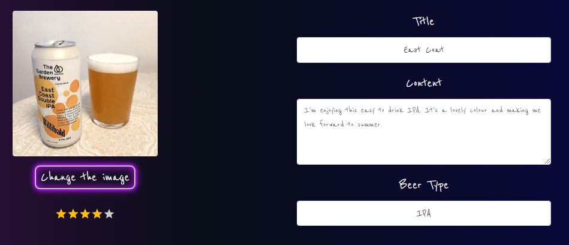  

When the logged in user clicks on the "Three dot" dropdown menu on their own posts they can click on the edit icon. They then can change all details on their post. Again the user is given an error message if the form data is invalid or left blank. Once they edit their post it takes them to the created post page.

### Post Page

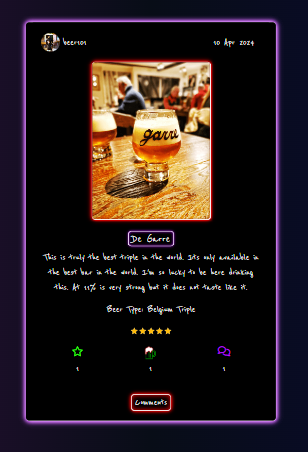  

This displays all the single post details which includes functionality to star and cheer the post if the user is logged in.  
The number of stars, cheers and comments are displayed which changes once one is added.  
There is a link to the comment modal were the user can view, add, edit and delete comments.

### Star and Cheers  

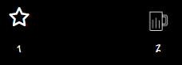  

  

A logged in user and not the owner of the post can star and cheer the posts by clicking on the empty icons. Once they are pressed the number of stars/cheers increases and they then can unstar/uncheer the post.  
Starring the post will add it to the users starred posts which they can look through using the filter on the side navigation menu.  
This functionality is reused on the post page and on the posts page where all posts are displayed.

### Comments

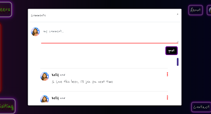  

This modal opens when "comments" is clicked on the post page.  
All the comments for the post can be viewed by scrolling down.    
If the user is logged in they can add a comment using the form.  
The logged in user can also delete and edit their comment using the dropdown menu. 

This modal is a change to the wireframes created during planning. It was added instead of the infinite scroll on each post because the infinite scroll container adds a new scroll-bar on this website due to the layout structure and I felt it wouldn't be the ideal customer experience.  
I feel like the modal works a lot better. It adds interactivity to the site and allows for easy comment CRUD functionality. 

### Posts Page

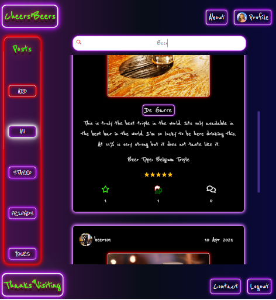  

This is the home page for the website and all posts will be seen and can be scrolled down until they are all shown.  
The logged in user can filter these posts using the side navigation bar and the relevant posts will be shown. The filters show their own posts, their stared posts and the posts of people they follow.  
The user can search through the posts using the search bar and this will search posts by author, title or type.  
The logged in user can use the star and cheer functionality on each post.
 

### Profile

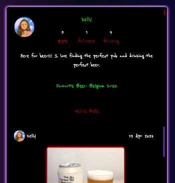  

Displays all the details provided by the profile owner. 
Displays the number of posts/ followers and people following which updates when these figures change.   
A dropdown menu only for the profile owner to edit their profile/username and password.  
All the profile owners posts can be scrolled underneath the profile owners details.  

### Edit Profile

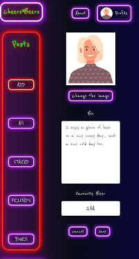  

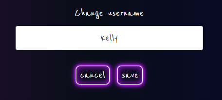  

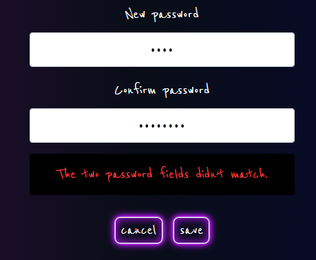  

The owner of the profile are taken to an edit page to edit their username/password or profile by clicking on the relevant button on the dropdown menu.  
All details can be changed and updated in their profile page.  

### About  

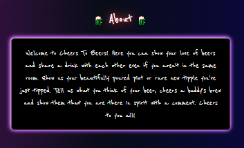  

Displays the welcome message for the website.

### Contact

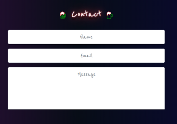  

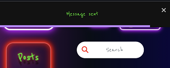  

Allows users to contact the admin of the site with their name, email and message.  
Upon submit they user is redirected home and given a success message. For this message the [React-Toastify](https://www.npmjs.com/package/react-toastify) package was installed and used, it provides a simple and effective way to give the user feedback.

### Favicon  

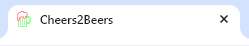

Displayed on the browsers tab.

### Page Not Found

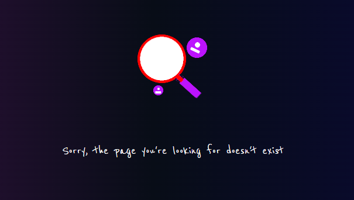  

If the user goes to an unknown page the page not found is displayed.

### Reusable React Components

#### Post  

This component is used throughout the website: on the posts page, single post page and profile page and its star/cheers functionality works wherever it is displayed.

#### Logo  

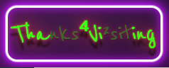  

This is used on the both the top and footer navigation bars and is passed the relevant props to display correctly.

#### Avatar  

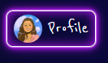  

This is used to display the users avatar on the top navigation, comment component, comment create component, post and profile edit component. It passes the relevant props for src, size and text if required.

#### Asset

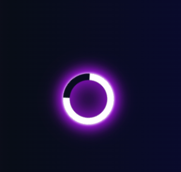  

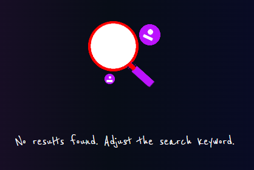  

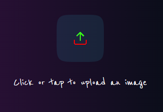  

This is used for the spinner, no-results icon and the image upload icon throughout the website. It passes the relevant props for src, spinner and message if required.  

#### More dropdown  

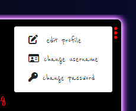  

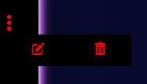  

This component is used three times on the profile page, post component (if on single post page) and the comments component. It returns  a different dropdown if on the profile page and passes back handle edit and handle delete props for the comments component and post component.

### Accessibility  

- The accessibility of the website was tested by both Wave and Lighthouse (score of 100), Please refer to [TESTING.MD](TESTING.md) page for details.  
- All the images have relevant alt descriptions.  
- Aria Labels are used correctly.  
- All the forms have labels.  
- There are no contrast errors.  
- The buttons have clear hover effects and also have a focus effect for keyboard users.

### Future Implementations  

There are two issues remaining after initial release of the website:  
- About page edit -  this will allow admin to log in as admin in the frontend and edit the message and title without going to the backend.  
- See contact messages - Again this will allow admin to log in on the frontend and see the contact messages created.  

Other future Implementations:  
- Error pages for specific errors.
- Review feature to allow members to review other members posts/drinks.
- Allow members to see who follows them.
- Allow members to see who stared or cheered their posts.
- Allow members to have direct message conversations with other members.
- Add a story type page where a member can show and see other members daily stories.

## Deployment  

### Heroku  

- Make sure the backend api has the correct CLIENT_ORIGIN convig var to match the frontend url. Details can be found in the README's deployment section of [Cheers-API-GitHub-Repository](https://github.com/DavidDock/cheers-api)
- Log in to Heroku and create App with unique name
- Click on deploy and choose GitHub and link to the repository [Cheers-To-Beers-GitHub-Repository](https://github.com/DavidDock/cheers-to-beers)
- Click on depoly branch
- Open App

Visit the deployed site: [Cheers-To-Beers](https://cheers-to-beers-4e5512c864fe.herokuapp.com/)  

### Fork Repository
- Go to the [Cheers-To-Beers-GitHub-Repository](https://github.com/DavidDock/cheers-to-beers)
- Click "Fork" which can be found in the top right corner

### Clone Repository
- Go to the [Cheers-To-Beers-GitHub-Repository](https://github.com/DavidDock/cheers-to-beers)
- Under the repository click on "go to" then under the "local" tab copy the HTTPS clone URL
- In your local development environment go to the terminal
- Change the current working directory to the location you want the cloned directory to be made
- Type "git clone" and then paste the clone URL and press enter

## Testing

Please refer to [TESTING.MD](TESTING.md)  

## Credits  

### Learning
The code used for this project was taught to me by code institute. The Code Institute's project run throughs 'Django Rest Framework' and 'Moments' helped me greatly with the development of my project.

## Media

- [Tinypng.com/](https://tinypng.com/) - Used to compress images
- [Favicon.io](https://favicon.io/) - Used to generate favicon
- [Iconpacks.net](https://www.iconpacks.net/) - Used for the beer glass icon
- [Amiresponsive](https://ui.dev/amiresponsive) - Used to see site on different devices and create the image for the top of this README