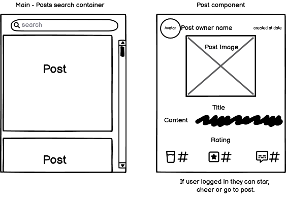

# Cheers To Beers  

Cheers To Beers is a social media platform where users can show thier love of different beers and share a drink with one another even if they aren't in the same room. It offers the chance to find friends, interact and review their own drinks.  
The deployed site can be found [Cheers-To-Beers](https://cheers-to-beers-4e5512c864fe.herokuapp.com/)

## CONTENTS

- [Cheers To Beers](#cheers-to-beers)
  - [CONTENTS](#contents)
  - [User Experience](#user-experience)
    - [Who is the Website for](#who-is-the-website-for)
    - [Design](#design)
    - [Colour Scheme](#colour-scheme)
    - [Typography](#typography)
    - [Wireframes](#wireframes)
  - [Agile Methodology](#agile-methodology)
  - [Technologies Used](#technologies-used)
    - [Languages Used](#languages-used)
    - [Frameworks Libaries and Programs Used](#frameworks-libaries-and-programs-used)
  - [Features](#features)
    - [Accessibility](#accessibility)
    - [Future Implementations](#future-implementations)
  - [Deployment](#deployment)
    - [Heroku](#heroku)
    - [Fork Repository](#fork-repository)
    - [Clone Repository](#clone-repository)
  - [Testing](#testing)
  - [Credits](#credits)
    - [Learning](#learning)
  - [Media](#media)

## User Experience

### Who is the Website for  
For people with an interest in beers and wish to interact with other like minded people through a socail media website. It allows people to review their drinks and interact with other members by giving them a cheers, commenting their post or following them. It allows peolpe to share a drink with eachother even if they are not physically together.

### Design  
The idea of this website is to take the user into a bar setting with a dark backround and neon colors to emulate bar signs.

### Colour Scheme
The color scheme fits in with the overal design goals. With a dark overall feel with neon colors to match the atmosphere of a bar.  
To meet WCAG 2.0 criteria, the color scheme was then passed to [eightshapes.com](https://eightshapes.com/) to generate an accessibility table, only accessible text colors were then used to ensure easy reading. Prodominantly white text was used as this worked well with the design theme.

### Typography
The choice of Typography again follows the overall style. Reenie-Beanie from [Google Fonts](https://fonts.google.com/specimen/Reenie+Beanie) was used throughout to add some playfull style to the website.

### Wireframes

## Agile Methodology 

Agile methodology was used throughout the deveploment for this project and I found it extremly helpful to keep track of my project.

The project was broken down into Epics and User Stories and the MoSCoW method was used to determine relevent features needed for the scope of this project.

Issues were created in GitHub for each Epic and User Story with Tasks to complete and MoSCoW labels on each one. A Kanban board was also created to keep track of these Issues. A Milestone for the MVP was also created and linked to relevant Issues.

The project's issues can be found [Here](https://github.com/DavidDock/cheers-to-beers/issues)

The project's Kanban board can be found [Here](https://github.com/users/DavidDock/projects/3)

The User Story table can be found below:

## Technologies Used  

### Languages Used  

### Frameworks Libaries and Programs Used  

- Git - Used for version control
- GitHub - Used to store the repository and GitHub projects for the Kanban board
- [Google Fonts](https://fonts.google.com/) - Used for the font
- [balsamiq](https://balsamiq.com/) - Used to create wireframes

## Features

### Accessibility  

### Future Implementations  

## Deployment  

### Heroku  

### Fork Repository

### Clone Repository

## Testing

Please refer to [TESTING.MD](TESTING.md)  

## Credits  

### Learning
The code used for this project was taught to me by code insitute. The Code Insitutes project run throughs 'Django Rest Framework' and 'Moments' helped me greatly with the development of my project.

## Media

- [Tinypng.com/](https://tinypng.com/) - Used to compress images
- [Favicon.io](https://favicon.io/) - Used to generate favicon
- [Amiresponsive](https://ui.dev/amiresponsive) - Used to see site on different devices and create the image for the top of this README