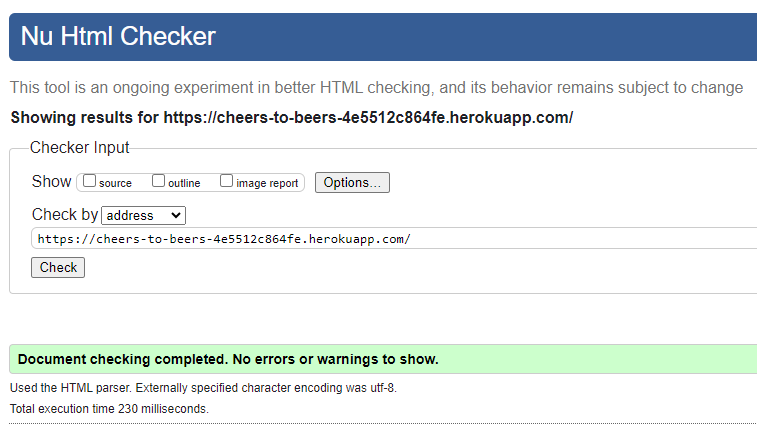
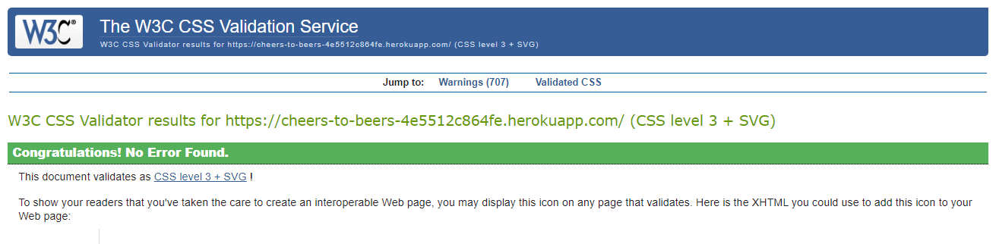
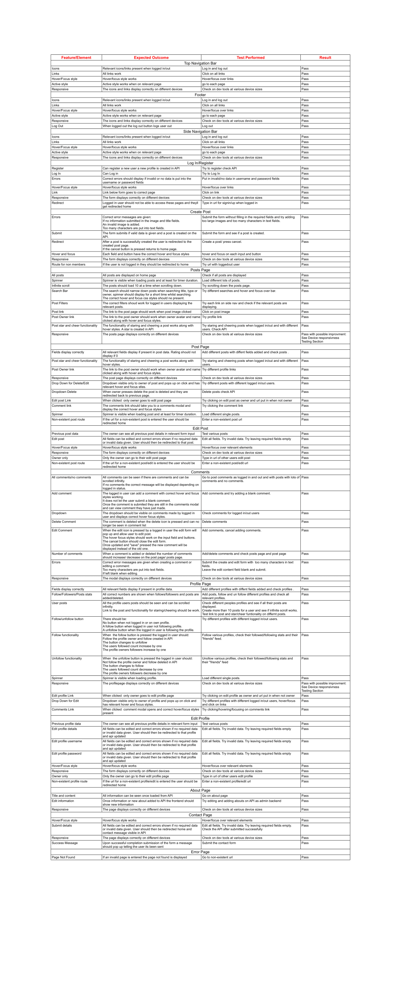

# CONTENTS

* [User Story Testing](#user-story-testing)
* [Browser Support](#browser-testing)
* [Device Responsiveness](#device-responsiveness)
* [JavaScript Validation](#javascript-validation)
* [CSS Validation](#css-validation)
* [Lighthouse](#lighthouse)
* [Wave](#wave)
* [Manual Testing](#manual-testing)

## User Story Testing  

### Create development environment
As a developer I need a development environment to the website can be create
 
#### Acceptance Criteria
* Have a working development environment

#### Results
The development environment was correctly created

### Deployment
As a developer I can view my deployed site so that I know everything is working correctly.
 
#### Acceptance Criteria
* See Deployed site

#### Results
The site was successfully deployed and can be viewed on Heroku

### Favicon
As a user I would like to quickly identify the websites tab so I can access it quickly
 
#### Acceptance Criteria
See the favicon

#### Results
The favicon can clearly be seen  

Current features created for user story:
- Favicon

### Navigation  
As a user I can view navbar, sidebar and footer from every page so that I can navigate easily between pages
 
#### Acceptance Criteria
Can see the basic nav bar, footer and sidebar.

#### Results
The top, side and footer navs can be correctly seen with relevant links to make the navigation on the site straight forward  

Current features created for user story:
- Top navbar, sidebar and footer

### Router  
As a user I can navigate through pages quickly so that I can view content seamlessly without page refresh
 
#### Acceptance Criteria
* Can navigate to pages using router.
* Can see a page not found if needed.

#### Results
The router is working correctly with all links created going to the correct route.  

### Connect to API  
As a developer I need the front and backend need connected to build the site.
 
#### Acceptance Criteria
Have the front and backend connected.

#### Results
The backend had given the front end permission to use the api and is connected correctly.

### Sign-up  
As a user I can create a new account so that I can access all the features for signed up users
 
#### Acceptance Criteria
A new user can sign up

#### Results
A new user can sign up correctly and a profile is created and relevant errors shown if details entered are incorrect

Current features created for user story:
- Sign-up page

### Sign-In  
As a user I can sign in to the app so that I can access functionality for logged in users
 
#### Acceptance Criteria
A user can sign in

#### Results
A user can sign in using the form with relevant errors shown if details entered are incorrect  

Current features created for user story:
- Sign-in page

### Logged in status  
As a user I can tell if I am logged in or not so that I can log in if I need to.
 
#### Acceptance Criteria
A user can see if they are logged in 

#### Results
When a user is logged in they can successfully see the relevant icons on all nav bars by using the current user context throughout the app.

### Refresh access tokens  
As a user I can maintain my logged-in status until I choose to log out so that my user experience is not compromised
 
#### Acceptance Criteria
The user stays logged in until they log out

#### Results
When logged in the user successfully stays logged in until they logout

### Sign-Out  
As a user I can sign out so I log out if needs be.
 
#### Acceptance Criteria
* The user can log out.
* Correct icons are displayed.

#### Results
When the logged in user logs out the current user successfully is null and the relevant icons can be seen  

Current features created for user story:
- Log out button

### Profile avatar  
As a user I can see my profile image when logged in to enhance user experience.
 
#### Acceptance Criteria
The logged in user can see their avatar.

#### Results
The logged in user can successfully see their avatar displayed  

Current features created for user story:
- Avatar

### Create Post  
As a logged in user I can create a post so I can share and interact with other users.
 
#### Acceptance Criteria
The logged in user van create a post.

#### Results
A user can successfully create a post with errors if invalid data given  

Current features created for user story:
- Create post page

### View Post Page  
As a user I can view a single post so I can read its details.
 
#### Acceptance Criteria
You can view a single post.

#### Results
A single post can be seen on posts/#id with all relevant information displayed  

Current features created for user story:
- Post component

### Star and Unstar a post  
As a logged in user I can star a post to add it to my starred posts and interact with other users.
 
#### Acceptance Criteria
You can star and unstar a post.

#### Results
A logged in user can successfully star and unstar a post. The owner of the post cant star their own post and a non-user is be prompted to log in upon hover.  
Once a post is stared the user can successfully see all those posts on their "stared" feed allowing easy access to their favourit posts.  

Current features created for user story:
- Star and cheer buttons

### View all posts  
As a user I can see all the posts so I can see peoples posts.
 
#### Acceptance Criteria
See all posts by most recent

#### Results
All posts can be successfully seen ordered by most recent  

Current features created for user story:
- Posts page

### Filter posts  
As a logged in user I can view all posts I have starred or of profiles I follow so I can interact with my favorite posts.
 
#### Acceptance Criteria
See all posts by filter when button pressed.

#### Results
When logged in each filter link can be pressed on the SideNav and relevant posts are shown.  

Current features created for user story:
- Side Navigation buttons and posts page filters

### Search Posts  
As a user I can search posts by author, title or type to improve navigation of site.
 
#### Acceptance Criteria
Search function working on Posts page

#### Results
The search function works within all or filtered posts, you can successfully search by title, type or user.  

Current features created for user story:
- Search bar on posts page with query feature

### Infinite scroll  
As a user I can continue scrolling posts as they auto load to improve user experience.
 
#### Acceptance Criteria
See posts loading when scrolling down

#### Results
The infinite scroll works on posts, fetching more posts every 10 posts.  

Current features created for user story:
- Infinite scroll component in single post page, profile and comments modal

### Edit Post  
As a logged in user I can edit a post if I want to amend details.
 
#### Acceptance Criteria
A logged in user can edit their post.

#### Results
The logged in user can successfully edit their post with new text fields, image and rating. They are then redirected to that post.  

Current features created for user story:
- Edit post page

### Delete Post  
As a logged on user I can delete my post.
 
#### Acceptance Criteria
A logged in user can delete their post.

#### Results
A logged in user can successfully delete their post.  

Current features created for user story:
- Delete button in dropdown

### Create a comment  
As a logged in user I can add a comment to a post to interact with other users.
 
#### Acceptance Criteria
* A comment can be added to a post.
* Number of comments of post can be seen.

#### Results
A logged in user can successfully create a comment and the number of comments increase under the comments icon.  

Current features created for user story:
- Comment create form component

### View comments  
As a user I can see all comments on a post to enhance interaction with the website.
 
#### Acceptance Criteria
* All comments can be seen under a post.
* Infinite scroll of comments.

#### Results
All comments can be seen in the comments modal when pressed, the comments keep loading when scrolling down until there are none left.  

Current features created for user story:
- Comment component, can be seen within the infinite scroll component on the post page comment modal

### Delete comment  
As a logged in user I can delete my own comment if I wish to.

#### Acceptance Criteria
* Can delete own comment.
* Correct number of comments is displayed.

#### Results
A user can successfully delete their own comment clicking on the dropdown in the comments modal and pressing the bin icon. The number of comments under the comments icon in the post then successfully decreases.  

Current features created for user story:
- Delete button in more dropdown comment in comment component

### Edit comment  
As a logged in user I can edit my comment if I wish to.
 
#### Acceptance Criteria
Can edit own comment

#### Results
The comment owner can click on the dropdown next to their comment and press the edit button, they then can edit the comment successfully.  

Current features created for user story:
- edit comment form component in comment component

### User Profile  
As a user I can see every users profile so I can find new posts, users and interact with them.
 
#### Acceptance Criteria
Can see all user details

#### Results
The user can successfully see all relevant details of the profile they clicked on with correct number of followers/following and posts displayed. A logged in user can see the follow/unfollow button depending if they follow the user or not.  

Current features created for user story:
- Profile page

### Profile Posts  
As a user I can see all users posts below their details so I can see what they have created.
 
#### Acceptance Criteria
Can see all user posts with infinite scroll.

#### Results
All the posts from the profile owner can be scrolled through and clicked on to go to the post.  

Current features created for user story:
- Infinite scroll component in profile page

### Follow, Unfollow user  
As a logged in user I can follow and unfollow user to interact with other users and see updated posts feed.
 
#### Acceptance Criteria
* A logged in user can follow and unfollow their user.
* Number of followers changes for relevant followers and following.

#### Results
A logged in user can successfully follow or unfollow another user by pressing the button, the number of followers automatically changes on the profile.  
When the user follows a new profile they can successfully see that persons posts on their "friends" feed to make it easier for the user to find relevant posts.  

Current features created for user story:
- Follow/unfollow buttons on profile page, following/followers stats on profile page

### Edit Profile  
As a logged in user I can edit my profile, name and password so I update my information.
 
#### Acceptance Criteria
A logged in user can update their name, password and profile information.

#### Results
The user can successfully change their username and password along with adding/editing their profile information. This allows them to share more of their details with the other users.  

Current features created for user story:
- Edit profile page, edit username page and edit password page

### Redirecting  
As a user I can only go onto pages that are relevant to improve user experience.
 
#### Acceptance Criteria
A user can only go onto relevant pages and gets redirected if they go on the wrong page.

#### Results  
A user is only allowed on correct pages and redirected away or to the page not found page.  

Current features created for user story:
- Use redirect hook

### About Page  
As a user I would like more information about the website so I can understand its goals and functions.
 
#### Acceptance Criteria
An about page can be seen.

#### Results

A user can click on the about page and successfully see the about message and see a description of the website.  
As admin in the backend [Cheers-API](https://cheers-to-beers-api-5a858b4697bd.herokuapp.com/) they can edit this message or create a new message and this then will be displayed in the about page.  

Current features created for user story:
- About page

### Contact Form  
As a user I can contact the site admin with a message so I can add feedback to the website.
 
#### Acceptance Criteria
A user can send a contact message

#### Results
The user can contact the admin with their suggestions or queries by sending a contact message and are given a success message once sent.  

Current features created for user story:
- Contact page and toast container

## Browser Testing
This website has been tested in google chrome and microsoft edge with no errors seen.  

## Device Responsiveness
This website is primarily developed for mobile devices as it is designed to be used on the go but it also works well on larger devices.  
Layout changes for different size devices are present and React bootstrap, along with css media queries have been used throughout to ensure responsiveness.  
Dev tools has been used throughout the development of the site to test responsiveness along with being tested on both laptop and mobile devices during the development . 
The website is responsive from as small as 320px wide and upwards. There are no overlapping elements and images aren't stretched or squashed.  

### Problems/Bugs highlighted and how they were fixed  

There was a minor issue during development relating to the infinite scroll feature:  
The layout of the site uses a scrollbar for the main section between the fixed top and bottom nav bar so when the infinite scroll container was added for all the posts to be seen in both the postspage and profile page another scrollbar is needed on larger devices (landscape). This is not ideal but in my opinion does not have a huge impact on the user experience and does not need changing but the fix I considered was to change the layout of the website to use fixed navigation bars instead of using css grid and overflow-y scroll.  
This prompted a change to the wirefames for the comments infinite scroll and a pop up modal was used for the comments instead to prevent the double scrollbar, this works extremely well and is an improvement to the initial design.  
During development it was noticed that user inputted data that had really long words in would cause responsive issues, in the unlikely event someone inputs a really long word I added word break css style to the effected elements.

## JSX Validation  

Most of the code validation was done through the gitpod ide problems tab which highlighted any unused vars or issues along the way.  
The formatting extension was used on all .js files to ensure correct formatting and indentation.  
All of the jsx files were also put through [eslint](https://eslint.org/play/).

### Problems/Bugs highlighted and how they were fixed  

On two occassions there were empty block statements which were filled by commented out console logs with the error.

### Final Test Results 

All passed through validation successfully.  
Unused and global var errors were highlighted due to the nature of testing each page externally but these were checked using th problems window in gitpod and no un-used vars were present.

## HTML Validation 

### Problems/Bugs highlighted and how they were fixed  

Unneccessary back slashes removed.

### Final Test Results 

The website html was run through [The-W3C-HTML-Validator](https://validator.w3.org/) which checked the index.html with no erros found.  

## CSS Validation 

### Problems/Bugs highlighted and how they were fixed  

On two occasions the margin and padding were given a value of none instead of 0 - this was changed to 0 to fix the errors.

### Final Test Results 

All the css modules and site url has been run through [The-W3C-CSS-Validator](https://jigsaw.w3.org/css-validator/) with no errors found.  

## Lighthouse  

### Problems/Bugs highlighted and how they were fixed  

Some forms were missing labels, these were added to improve the results.  
An autocompelte attribute was missing from the signIn/Up form, this was added to improve results.  
An unnecessary arial label for the comments link was highlighted and removed.  

### Final Test Results  

## Wave  

### Problems/Bugs highlighted and how they were fixed  

Initially Wave picked up on quite a few errors relating to form labels. Necessary labels were added. Some of the form labels were present but with display-none which was satisfactory for Lighthouse but was changed to screen reader only to fix the issue and make more accessible.

### Final Test Results  

No errors or contrasct errors present on any page.  
There were multiple alerts rgarding redundant links and possible headings, these were looked into but these do not overly impact the website.  

## Manual Testing  

